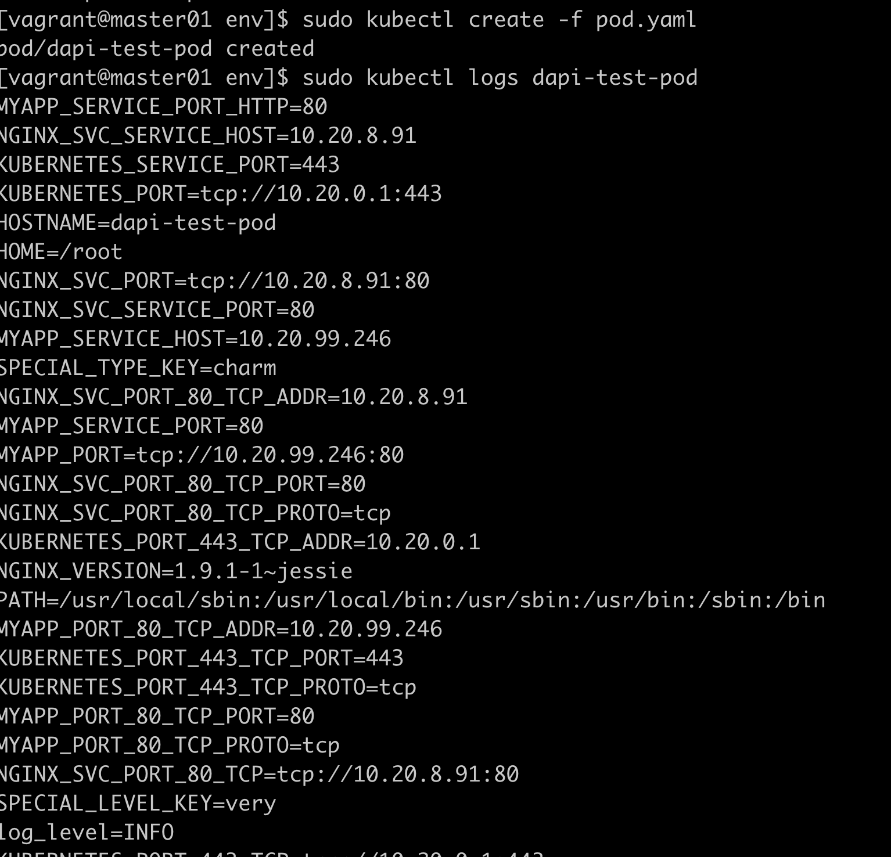
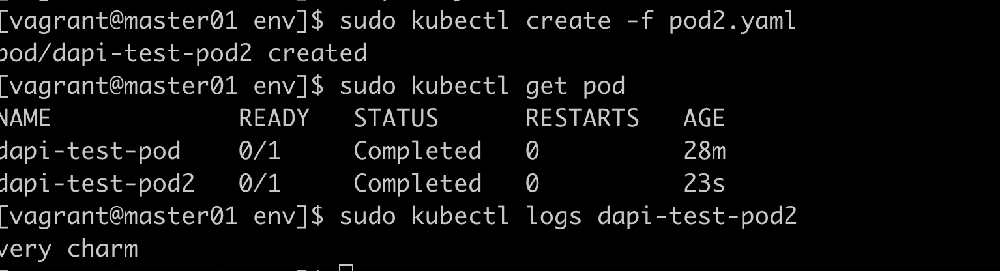
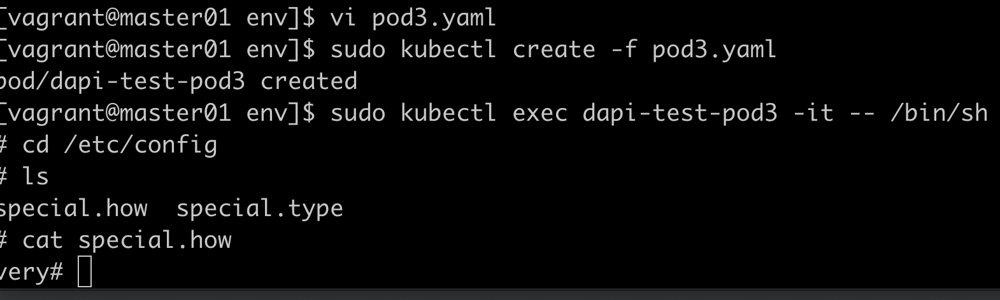
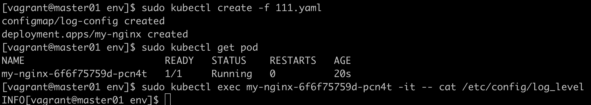
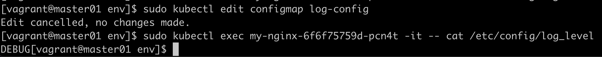

# configMap

sudo kubectl create configmap game-config --from-file=../dir/  
sudo kubectl get cm

## 实验configmap设置环境变量

special.yaml
```yaml
apiVersion: v1
kind: ConfigMap
metadata:
  name: special-config
  namespace: default
data:
  special.how: very
  special.type: charm
```

env.yaml
```yaml
apiVersion: v1
kind: ConfigMap
metadata:
  name: env-config
  namespace: default
data:
  log_level: INFO
```

pod.yaml
```yaml
apiVersion: v1
kind: Pod
metadata:
  name: dapi-test-pod
spec:
  containers:
   - name: test-container
     image: nginx:1.9.1
     command: ["/bin/sh", "-c", "env"]
     env:
       - name: SPECIAL_LEVEL_KEY
         valueFrom:
           configMapKeyRef:
             name: special-config
             key: special.how
       - name: SPECIAL_TYPE_KEY
         valueFrom:
           configMapKeyRef:
             name: special-config
             key: special.type
     envFrom:
       - configMapRef:
           name: env-config
  restartPolicy: Never
```

!!! 注意对齐

    上面如果envFrom和env要对齐，如果不对齐，报did not find expected '-' indicator  
    注意restartPolicy是跟containers对齐



## 实验configmap设置命令行参数

pod2.yaml
```yaml
apiVersion: v1
kind: Pod
metadata:
  name: dapi-test-pod2
spec:
  containers:
   - name: test-container
     image: nginx:1.9.1
     command: ["/bin/sh", "-c", "echo $(SPECIAL_LEVEL_KEY) $(SPECIAL_TYPE_KEY)"]
     env:
       - name: SPECIAL_LEVEL_KEY
         valueFrom:
           configMapKeyRef:
             name: special-config
             key: special.how
       - name: SPECIAL_TYPE_KEY
         valueFrom:
           configMapKeyRef:
             name: special-config
             key: special.type
  restartPolicy: Never
```


## 实验configmap使用数据卷

pod3.yaml
```yaml
apiVersion: v1
kind: Pod
metadata:
  name: dapi-test-pod3
spec:
  containers:
   - name: test-container
     image: nginx:1.9.1
     command: ["/bin/sh", "-c", "sleep 600s"]
     volumeMounts:
       - name: config-volume
         mountPath: /etc/config
  volumes:
    - name: config-volume
      configMap:
        name: special-config
  restartPolicy: Never
```


## 实验configmap热更新

```yaml
apiVersion: v1
kind: ConfigMap
metadata:
  name: log-config
  namespace: default
data:
  log_level: INFO
---
apiVersion: apps/v1
kind: Deployment
metadata:
  name: my-nginx
spec:
  replicas: 1
  selector: 
    matchLabels:
      name: nginx
  template:
    metadata:
      labels:
        run: my-nginx
        name: nginx
    spec:
      containers:
        - name: my-nginx
          image: nginx:1.9.1
          ports:
            - containerPort: 80
          volumeMounts:
            - name: config-volume
              mountPath: /etc/config
      volumes:
        - name: config-volume
          configMap:
             name: log-config
```



修改configmap，把日志级别从INFO改成DEBUG  

