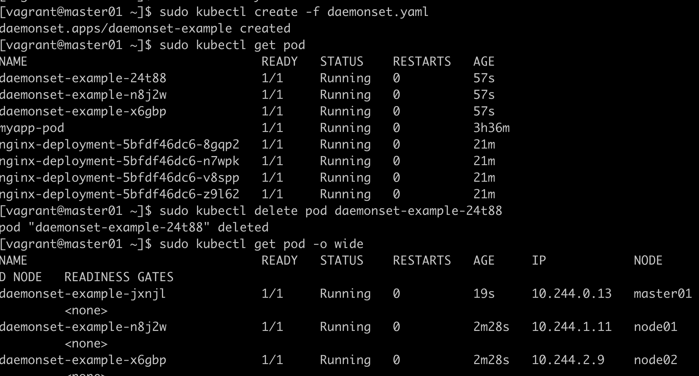

# DaemonSet

```yaml
apiVersion: apps/v1
kind: DaemonSet
metadata:
  name: daemonset-example
  labels:
    app: daemonset
spec:
  selector: 
    matchLabels:
      name: daemonset-example
  template:
    metadata:
      labels:
        name: daemonset-example
    spec:
      containers:
      - name: daemonset-example
        image: nginx:1.9.1
```

可以看到，daemonset保持一个节点一个pod，删除后也会保持一个  