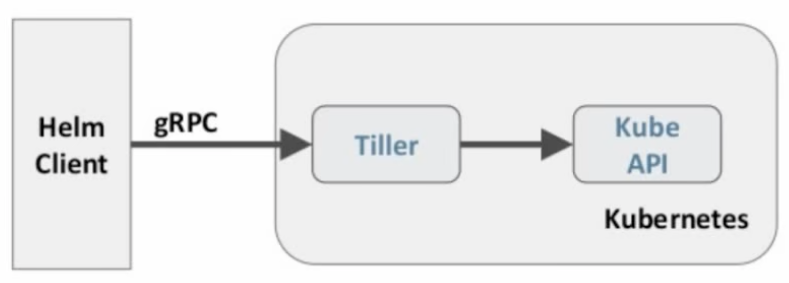

# Helm

包管理工具，解决安装问题  
Chart应用的信息集合，包括各种k8s对象的配置模版、参数定义、依赖关系，文档说明等。  
release是Chart的运行实例 

helm2原理：  
   

## 安装

!!! 注意

    视频中helm使用的是helm2，要对应下载这个版本

```bash
ntpdate ntp1.aliyun.com
wget https://get.helm.sh/helm-v2.17.0-linux-amd64.tar.gz
tar -zxvf helm-v2.17.0-linux-amd64.tar.gz
cd linux-amd64/
sudo cp helm /usr/local/bin/
```

```yaml
apiVersion: v1
kind: ServiceAccount
metadata:
  name: tiller
  namespace: kube-system
---
apiVersion: rbac.authorization.k8s.io/v1
kind: ClusterRoleBinding
metadata:
  name: tiller
roleRef:
  apiGroup: rbac.authorization.k8s.io
  kind: ClusterRole
  name: cluster-admin
subjects:
  - kind: ServiceAccount
    name: tiller
    namespace: kube-system
```


## Helm自定义模版

mkdir hello-world
cd hello-world   
cat << 'EOF'  > ./Chart.yaml
name: hello-world
version: 1.0.0
EOF

mkdir templates  
cat << 'EOF' > ./templates/deployment.yaml
apiVersion: apps/v1
kind: Deployment
metadata: 
  name: hello-world
spec:
  replicas: 1
  selector:
    matchLabels:
      app: hello-world
  template:
    metadata:
      labels:
        app: hello-world
    spec:
      containers:
        - name: hello-world
          image: nginx:1.9.1
          ports:
            - containerPort: 80
              protocol: TCP
EOF

cat << 'EOF' > ./templates/service.yaml
apiVersion: v1
kind: Service
metadata: 
  name: hello-world
spec:
  ports:
    - port: 8080
      targetPort: 8080
      protocol: TCP
  selector:
    app: hello-world
EOF


!!! 调试helm

    调试时，修改完脚本，helm upgrade <release> .，这时版本信息会变成2

问题：service没有出现随机端口，无法通过浏览器访问

## 更新实验

cat <<'EOF' > ./values.yaml
image:
  repository: gcr.io/google-samples/node-hello
  tag: '2.0'
EOF

cat <<'EOF' > ./templates/deployment.yaml
apiVersion: apps/v1
kind: Deployment
metadata:
  name: hello-world
spec:
  replicas: 1
  selector:
    matchLabels:
      app: hello-world
  template:
    metadata:
      labels:
        app: hello-world
    spec:
      containers:
        - name: hello-world
          image: {{ .Values.image.repository }}:{{ .Values.image.tag }}
          ports:
            - containerPort: 8080
              protocol: TCP
EOF


## 命令

完整删除： helm delete --purge <release>  
delete之后可以通过rollback还原：  helm rollback <release> 版本号  
尝试运行： helm install --dry-run .  

## helm部署dashboard

```yaml
image:
  repository: k8s.gcr.io/kubernetes-dashboard-amd64
  tag: v1.10.1
ingress:
  enabled: true
  hosts:
    - k8s.frognew.com
  annotations:
    nginx.ingress.kubernetes.io/ssl-redirect: "true"
    nginx.ingress.kubernetes.io/backend-protocol: "HTTPS"
  tls:
    - secretName: frognew-com-tls-secret
      hosts:
        - k8s.frognew.com
rbac:
  clusterAdminRole: true
```
由于k8s版本不一致，dashboard无法部署

## 部署prometheus

[kube-prometheus项目地址](https://github.com/prometheus-operator/kube-prometheus)  
可以尝试quickstart步骤  

或者：  
1、cd kube-prometheus/manifests  
2、vim grafana-service.yaml
```yaml
apiVersion: v1
kind: Service
metadata:
  name: grafana
  namespace: monitoring
spec:
  type: NodePort #添加内容
  ports:
    - name: http
      port: 3000
      targetPort: http
      nodePort: 30100 #添加内容
  selector:
    app: grafana
```
3、vim prometheus-service.yaml
```yaml
apiVersion: v1
kind: Service
metadata:
  labels:
    prometheus: k8s
    name: prometheus-k8s
    namespace: monitoring
spec:
  type: NodePort
  ports:
    - name: web
      port: 9090
      targetPort: web
      nodePort: 30200
  selector:
    app: prometheus
    prometheus: k8s
```
4、vim alertmanager-service.yaml
```yaml
apiVersion: v1
kind: Service
metadata:
  labels:
    alertmanager: main
  name: alertmanager-main
  namespace: monitoring
spec:
  type: NodePort
  ports:
    - name: web
      port: 9093
      targetPort: web
      nodePort: 30300
  selector:
    alertmanager: main
    app: alertmanager
```

先进setup： kubectl create -f .  
kubectl apply -f manifests/  

grafana： http://node01:30100/  
prometheus： http://node01:30200/  


## HPA

Horizontal Pod Autoscaling，可以根据cpu利用率自动伸缩一个RC、deployment或rs  
这里有个google的自动扩容实验（php-apache）  

kubectl run php-apache --image=gcr.io/google_containers/hpa-example --requests=cpu=200m --expose --port=80  
创建hpa控制器:  
kubectl autoscale deployment php-apache --cpu-percent=50 --min=1 --max=10  

增加负载，查看负载节点数目：  
kubectl run -i --tty load-generator --image=busybox /bin/sh  
while true; do get -q -O- http://php-apache.default.svc.cluster.local; done  

## 资源限制

request最小，limit最大  
default就是limit，defaultRequest就是request  