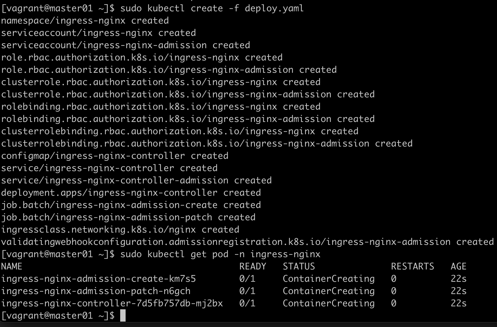

# Ingress

对外https，对内http，起到一个统一会话卸载作用  
ingress是基于nginx的一个反向代理，[项目地址](https://kubernetes.github.io/ingress-nginx/deploy/)

## ingress实验（失败）

wget https://raw.githubusercontent.com/kubernetes/ingress-nginx/controller-v1.5.1/deploy/static/provider/cloud/deploy.yaml  
kubectl apply -f deploy.yaml  


碰到问题，虚拟机中无法拉取nginx-admission镜像，报ErrImagePull  

wget https://raw.githubusercontent.com/kubernetes/ingress-nginx/controller-v1.5.1/deploy/static/provider/baremetal/deploy.yaml  

## ingress http代理访问（失败）

ingress.http.yaml
```yaml
apiVersion: apps/v1
kind: Deployment
metadata:
  name: nginx-dm
spec:
  replicas: 2
  selector:
    matchLabels:
      app: nginx
  template:
    metadata:
      labels:
        app: nginx
    spec:
      containers:
      - name: nginx
        image: nginx:1.9.1
        imagePullPolicy: IfNotPresent
        ports:
        - containerPort: 80
---
apiVersion: v1
kind: Service
metadata:
  name: nginx-svc
spec:
  ports:
  - port: 80
    targetPort: 80
    protocol: TCP
  selector:
    name: nginx
---
apiVersion: extensions/v1beta1
kind: Ingress
metadata:
  name: nginx-test
spec:
  rules:
  - host: www1.atguigu.com
    http:
      paths:
      - path: /
        backend:
          serviceName: nginx-svc
          servicePort: 80
```