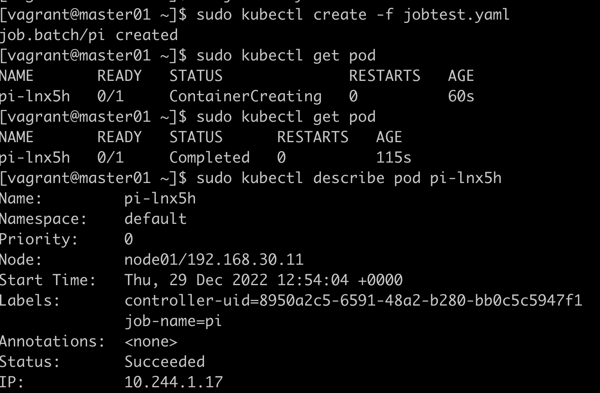
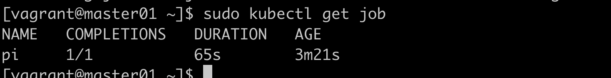

# Job

```yaml
apiVersion: batch/v1
kind: Job
metadata:
  name: pi
spec:
  template:
    metadata:
      name: pi
    spec:
      containers:
      - name: pi
        image: perl
        command: ["perl", "-Mbignum=bpi", "-wle", "print bpi(2000)"]
      restartPolicy: Never
```


查看job状态：  


加载一个压缩包： docker load -i perl.tar

## CronJob

```yaml
apiVersion: batch/v1
kind: CronJob
metadata:
  name: hello
spec:
  schedule: "*/1 * * * *"
  jobTemplate:
    spec:
      containers:
      - name: hello
        image: busybox:1.28
        imagePullPolicy: IfNotPresent
        command:
        - /bin/sh
        - -c
        - date; echo Hello from the Kubernetes cluster
      restartPolicy: OnFailure
```