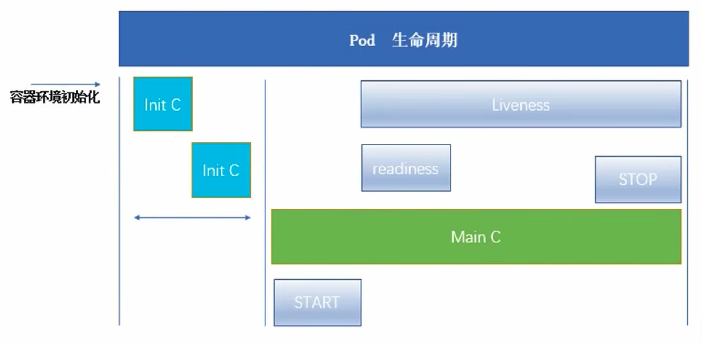

# Pod

自主式pod: pod退出了，此类型的pod不会被创建  
控制器管理的pod： 在控制器生命周期里，始终要维持pod的副本数  

一个pod里面有多个容器，都有一个pause的容器  
RC ReplicationController，确保容器应用副本数保持在用户定义的副本数  
新版本用RS取代RC，ReplicaSet支持集合式selector  
RS不支持滚动更新，Deployment支持，deployment包含RS，RS管理pod   
HPA水平自动扩展，是deployment和RS里面的概念       
DaemonSet所有pod中都需要运行的副本，比如日志收集，监控  
pod之间跨主机如何实现通讯：Flannel覆盖网络工具，使每个主机有一个完整的子网  

## StatefulSet

解决有状态服务问题，应用场景：  
1、稳定的持久化存储  
2、稳定的网络标志  
3、有序部署  
4、有序收缩  

## DaemonSet

确保全部（或者某些）节点上运行一个 Pod 的副本。
只需运行一个的场景，比如logstash，比如每个node只需部署一个prometheus node exporter  

## Job/Cron Job

job负责批处理任务，job会判断失败可以重试

## pod生命周期

缺一个pause，实际会有多个主容器  
readness 就绪检测，检测完才会显示running    
liveness 生存检测，不一致则重启  

init容器与普通容器区别：  
1、init容器总是运行到成功完成为止  
2、每个init容器都必须在下个init容器启动之前成功完成  

init c的一个场景，一个pod中多个容器有依赖时，可以加init c来检测  

sudo kubectl get pod -w   -w持续打印  

进入容器： kubectl exec lifecycle-demo -it -- /bin/sh

