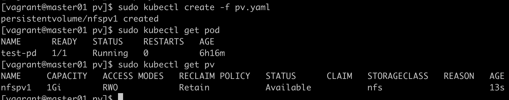

# PV

pvc寻找一个合适的pv并绑定，是pv的一种请求方案  
pvc跟pv绑定是一对一的映射

## 访问模式

ReadWriteOnce 该卷可以被单个节点以读写模式挂载  
ReadOnlyMany 该卷可以被多个节点以只读模式挂载  
ReadWriteMany 该卷可以被多个节点以读写模式挂载  

在命令行中，访问模式缩写为：  
RWO ReadWriteOnce  
ROX ReadOnlyMany  
RWX ReadWriteMany  

## 回收策略

Retain 保留，手动回收  
Recycle 回收，基本擦除（最新已经被废除）    
Delete 删除，关联的存储资产将被删除   

当前，只有NFS和HostPath支持回收策略，其他只支持删除策略  

## 状态 

Available 可用  
Bound 已绑定，卷已经声明被绑定    
Release 已释放，声明被删除，但是资源还未被集群重新声明    
Failed 失败，该卷的自动回收失败  

## NFS部署pv实验

### 安装NFS服务器

```bash
yum install -y nfs-common nfs-utils rpcbind  
cd /home/vagrant
mkdir nfsdata
chown nfsnobody nfsdata
chmod 777 nfsdata
cat /etc/exports
    /home/vagrant/nfsdata 192.168.30.0/24 (rw, no_root_squash, no_all_squash, sync)
systemctl start rpcbind
systemctl start nfs
```
安装完服务端，需要在所有节点安装客户端
```bash
sudo yum install nfs-utils rpcbind -y
```
### 测试nfs

```bash
mkdir /test
showmount -e 192.168.30.12
mount -t nfs 192.168.30.12:/home/vagrant/nfsdata /home/vagrant/test
```
在客户端新增一个文件，服务端同步会更新则成功  
我实验是在root用户下做成功的

### 部署pv

```yaml
apiVersion: v1
kind: PersistentVolume
metadata:
  name: nfspv1
spec:
  capacity:
    storage: 1Gi
  accessModes:
    - ReadWriteOnce
  persistentVolumeReclaimPolicy: Retain
  storageClassName: nfs
  nfs:
    path: /home/vagrant/nfsdata
    server: 192.168.30.12
```


```yaml
apiVersion: v1
kind: Service
metadata:
  name: nginx
  labels:
    app: nginx
spec:
  ports:
    - port: 80
      name: web 
  clusterIP: None
  selector:
    app: nginx
---
apiVersion: apps:/v1
kind: StatefulSet
metadata:
  name: web
spec:
  selector:
    matchLabels:
      app: nginx
  serviceName: "nginx"
  replicas: 3
  template:
    metadata:
      labels:
        app: nginx
    spec:
      containers:
        - name: nginx
          image: nginx:1.9.1
          ports:
            - containerPort: 80
              name: web
          volumeMounts:
            - name: www
              mountPath: /usr/share/nginx/html
  volumeClaimTemplates:
    - metadata:
        name: www
      spec:
        accessMode: ["ReadWriteOnce"]
        storageClassName: "nfs"
        resources:
          requests:
            storage: 1Gi
```

批量创建多个目录： mkdir nfsdata{1..3}

实验水过