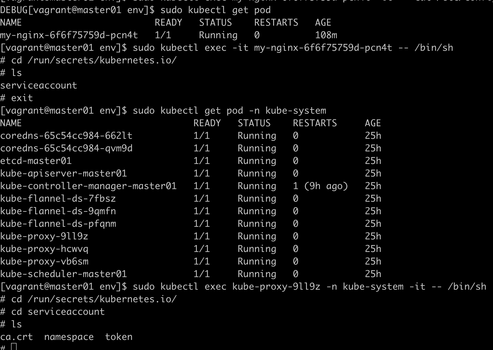
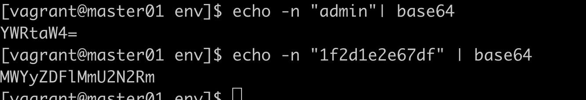
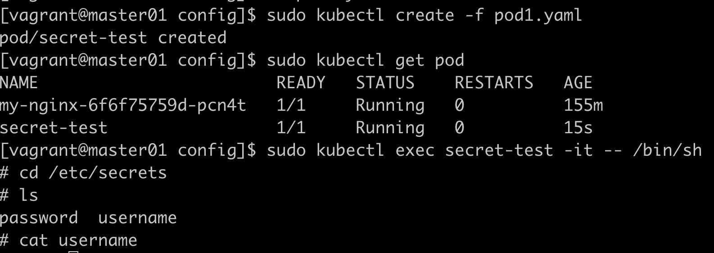
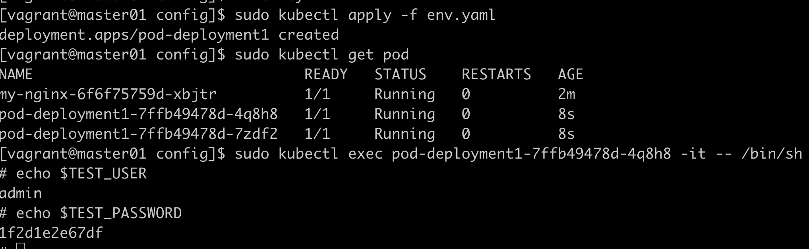

# Secret

secret解决了密码、token、密钥等敏感数据的配置问题

## Secret有三种类型

Service Account: 给pod访问  
Opaque: base64编码格式的secret，用来存储密码、密钥等  
kubernetes.io/dockerconfigjson: 用来存储私有docker registry的认证信息  

## service account 



## opaque

得到用户名密码的base64编码


解密： echo -n "YWRtaW4=" | base64 -d

```yaml
apiVersion: v1
kind: Secret
metadata:
  name: mysecret
type: Opaque
data:
  password: MWYyZDFlMmU2N2Rm
  username: YWRtaW4=
```

## secret挂载到volume中

```yaml
apiVersion: v1
kind: Pod
metadata:
  labels:
    name: secret-test
  name: secret-test
spec:
  volumes:
    - name: secrets
      secret:
        secretName: mysecret
  containers:
    - image: nginx:1.9.1
      name: db
      volumeMounts:
        - name: secrets
          mountPath: "/etc/secrets"
          readOnly: true
```


## secret导出到环境变量中

```yaml
apiVersion: apps/v1
kind: Deployment
metadata:
  name: pod-deployment1
spec:
  replicas: 2
  selector: 
    matchLabels:
      name: pod1
  template:
    metadata:
      labels:
        app: pod-deployment1
        name: pod1
    spec:
      containers:
        - name: pod-1
          image: nginx:1.9.1
          ports:
            - containerPort: 80
          env:
            - name: TEST_USER
              valueFrom:
                secretKeyRef:
                  name: mysecret
                  key: username
            - name: TEST_PASSWORD
              valueFrom:
                secretKeyRef:
                  name: mysecret
                  key: password
```
