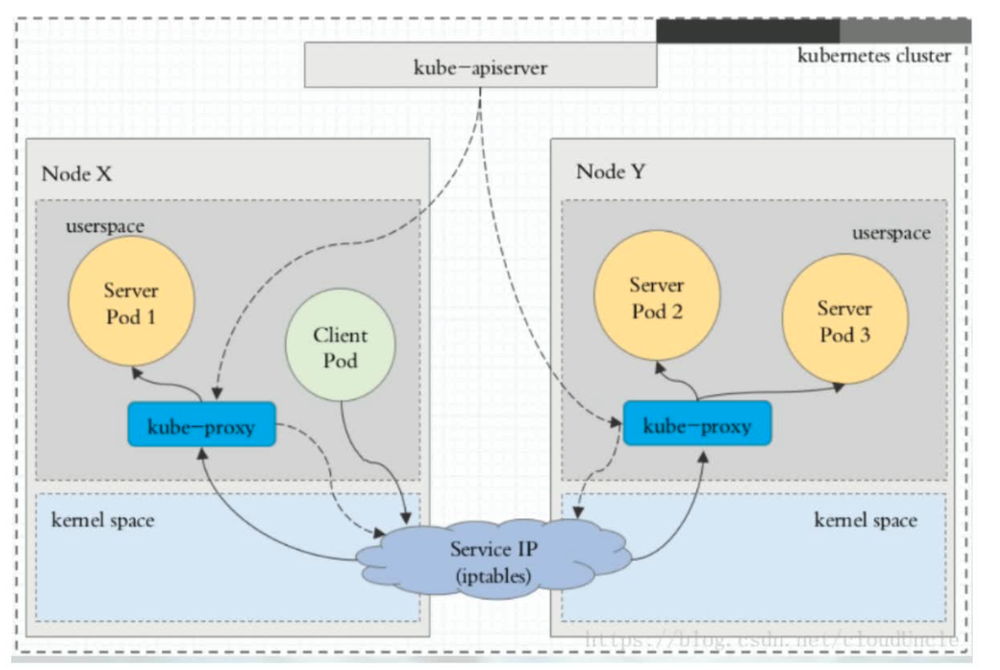
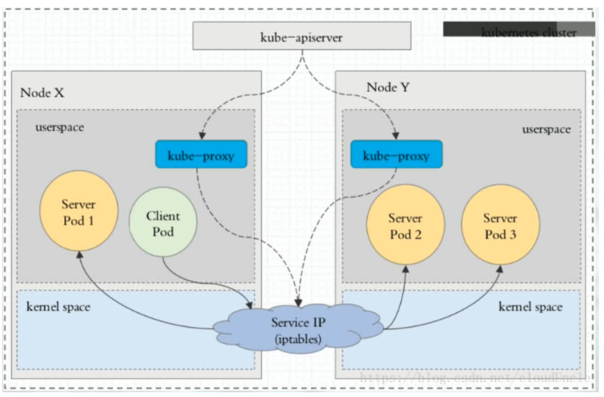
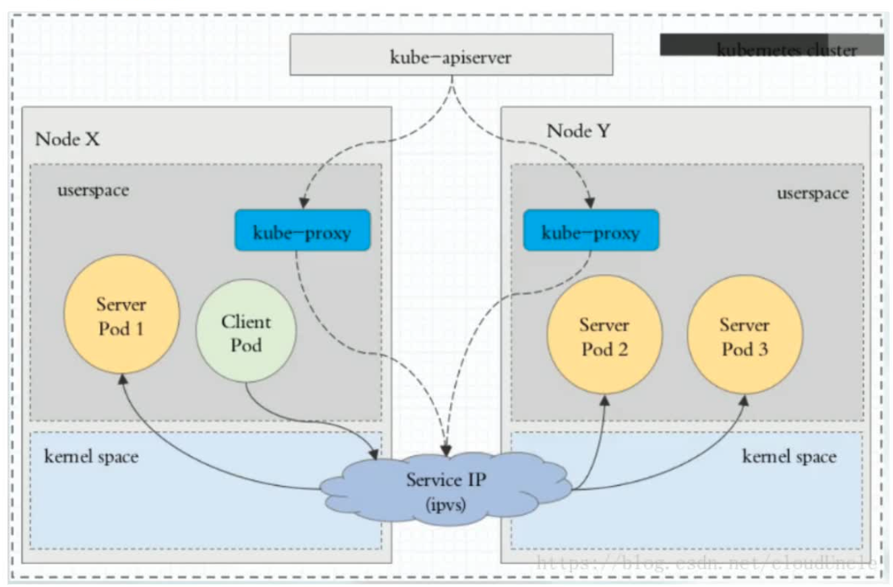
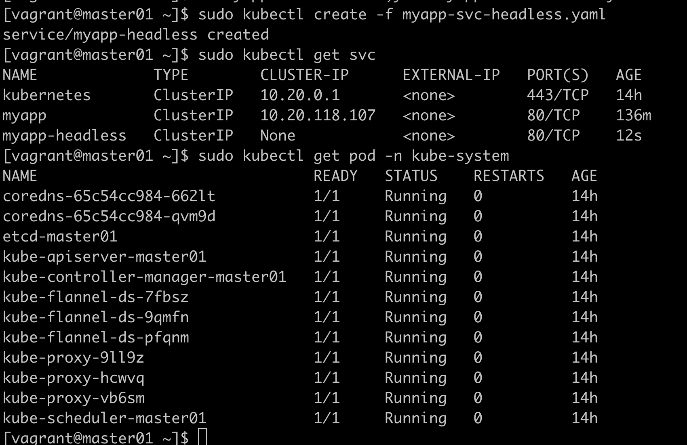
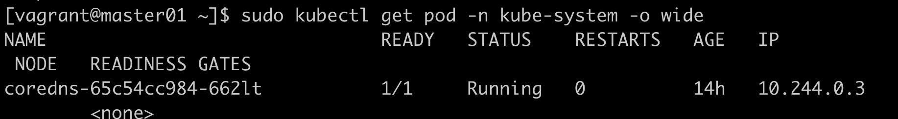
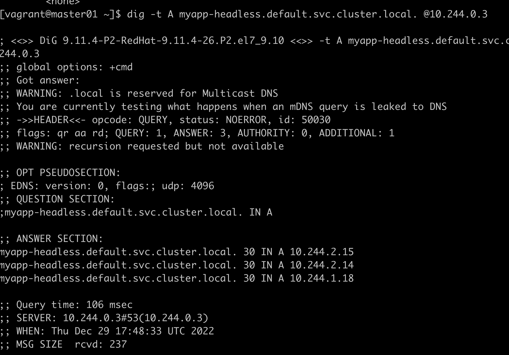

# service

用来做服务发现

## 四种类型

| 类型 | 说明 |
| ---- | ---- |
| ClusterIp | 默认类型，自动分配一个仅Cluster内部可以访问的虚拟IP |
| NodePort  | 在ClusterIP基础上为Service在每台机器上绑定一个端口，这样就可以通过NodePort来访问该服务    |
| LoadBalancer  | 在NodePort的基础上，借助cloud provider创建一个外部负载均衡器，并将请求转发到NodePort   |
| ExternalName   | 把集群外部的服务引入到集群内部来，在集群内部直接使用。没有任何类型代理被创建   |  

## 代理模式的分类

userspace代理模式


iptables代理模式


ipvs模式  


## 实验

myapp-deploy.yaml
```yaml
apiVersion: apps/v1
kind: Deployment
metadata:
  name: myapp-deploy
  namespace: default
spec:
  replicas: 3
  selector:
    matchLabels:
      app: myapp
      release: stabel
  template:
    metadata:
      labels:
        app: myapp
        release: stabel
        env: test
    spec:
      containers:
      - name: myapp
        image: nginx:1.9.1
        imagePullPolicy: IfNotPresent
        ports:
        - name: http
          containerPort: 80
```

myapp-service.yaml
```yaml
apiVersion: v1
kind: Service
metadata:
  name: myapp
  namespace: default
spec:
  type: ClusterIP
  selector:
    app: myapp
    release: stabel
  ports:
  - name: http
    port: 80
    targetPort: 80
```
通过sudo ipvsadm -Ln来查看这段没理解

## 不使用负载均衡

vi myapp-svc-headless.yaml
```yaml
apiVersion: v1
kind: Service
metadata:
  name: myapp-headless
  namespace: default
spec:
  selector:
    app: myapp
  clusterIP: "None"
  ports:
  - port: 80
    targetPort: 80
```


sudo yum -y install bind-utils





这个实验说明，尽管没有自己的svc了，依然可以通过域名的方式进行访问

## NodePort

```yaml
apiVersion: v1
kind: Service
metadata:
  name: myapp
  namespace: default
spec:
  type: NodePort
  selector:
    app: myapp
    release: stabel
  ports:
  - name: http
    port: 80
    targetPort: 80
```

实验水过  
可以按文件删除： sudo kubectl delete -f nodeport.yaml