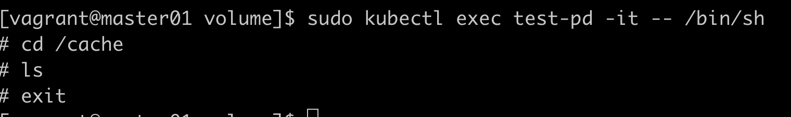
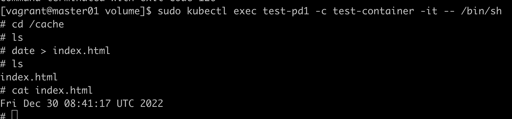
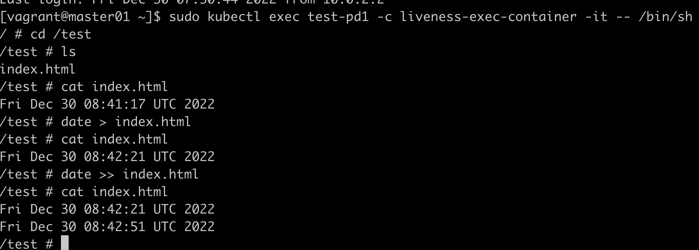

# Volume

## emptyDir用法

暂存空间，例如用于基于磁盘的合并排序  
用作长时间计算崩溃恢复时的检查点  
web服务器容器提供数据时，保存内容管理器容器提权的文件

```yaml
apiVersion: v1
kind: Pod
metadata:
  name: test-pd
spec:
  containers:
    - image: nginx:1.9.1
      name: nginx
      volumeMounts:
        - mountPath: /cache
          name: cache-volume
  volumes:
    - name: cache-volume
      emptyDir: {}
```

挂载空卷，没东西

以下演示两个容器挂载同一个volume
```yaml
apiVersion: v1
kind: Pod
metadata:
  name: test-pd1
spec:
  containers:
    - image: nginx:1.9.1
      name: test-container
      volumeMounts:
        - mountPath: /cache
          name: cache-volume
    - name: liveness-exec-container
      image: busybox
      imagePullPolicy: IfNotPresent
      command: ["/bin/sh", "-c", "sleep 6000s"]
      volumeMounts:
        - mountPath: /test
          name: cache-volume
  volumes:
    - name: cache-volume
      emptyDir: {}
```


另起一个终端


## hostPath

将主机节点的文件系统中的文件或目录挂载到集群中

用途：  
1、运行需要访问docker内部的容器；使用/var/lib/docker的hostPath  
2、在容器中运行cAdvisor; 使用/dev/cgroups的hostPath

```yaml
apiVersion: v1
kind: Pod
metadata:
  name: test-pd
spec:
  containers:
    - image: nginx:1.9.1
      name: test-container
      volumeMounts:
        - mountPath: /test-pd
          name: test-volume
  volumes:
    - name: test-volume
      hostPath:
        path: /data
        type: DirectoryOrCreate
```

!!! hostPath type check failed

    只要把type的Directory改成DirectoryOrCreate就ok。
    原因：分布式环境下所有机器都应该建/data目录

从实验可以看到，容器中增加了一个文件，某一台宿主机的/data目录也增加了文件