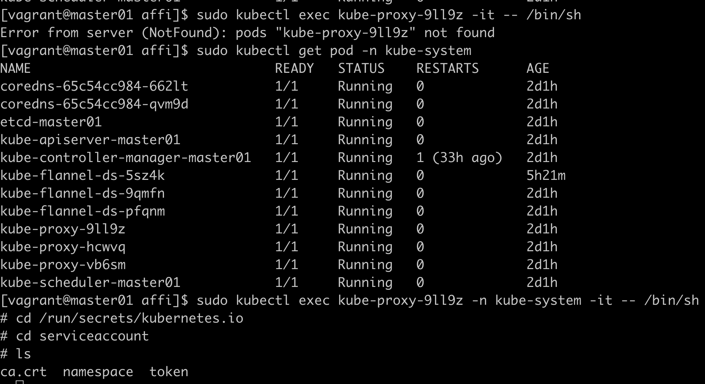
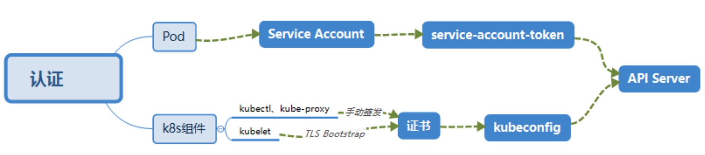
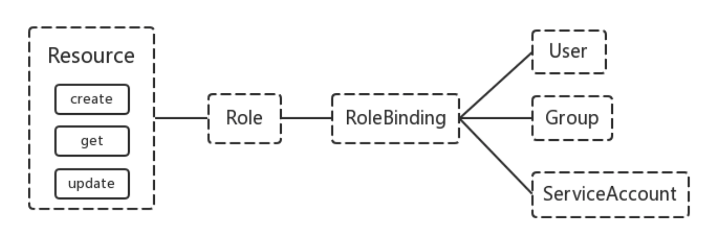

# 安全认证

k8s的安全机制基本是围绕保护api server来设计的。

## 认证

http token认证  
http base认证，通过用户名+密码方式认证，base64编码  
最严格的https证书认证  


两种认证方式，pod内部直接http，k8s组件用https双向认证  


## 鉴权

授权策略：  
1、AlwaysDeny  
2、AlwaysAllow  
3、ABAC  
4、Webbook，通过调用外部rest服务对用户进行授权  
5、RBAC，默认规则  

RBAC引入4个顶级资源对象：Role、ClusterRole、RoleBinding、ClusterRoleBinding


k8s不提供用户管理，是从ca证书里面管理的  
把CN字段作为User，names.O字段作为Group  
pod使用ServiceAccount认证时，service-account-token中的jwt会保存User信息

Role定义在一个namespace中，如果想要跨namespace则可以创建ClusterRole  
RoleBinding可以将角色中定义的权限授予用户或用户组

## 实验：创建一个用户只能管理dev空间

devuser-csr.json
```json
{
  "CN": "devuser",
  "hosts": [],
  "key": {
    "algo": "rsa",
    "size": 2048
  },
  "names": [
    {
      "C": "CN",
      "ST": "BeiJing",
      "L": "BeiJing",
      "O": "k8s",
      "OU": "System"
    }
  ]
}
```
wget https://pkg.cfssl.org/R1.2/cfssl_linux-amd64  
mv cfssl_linux-amd64 /usr/local/bin/cfssl  
wget https://pkg.cfssl.org/R1.2/cfssljson_linux-amd64  
mv cfssljson_linux-amd64 /usr/local/bin/cfssljson  
wget https://pkg.cfssl.org/R1.2/cfssl-certinfo_linux-amd64  
mv cfssl-certinfo_linux-amd64 /usr/local/bin/cfssl-certinfo  
cfssl gencert -ca=ca.crt -ca-key=ca.key -profile=kubernetes /root/devuser-csr.json | cfssljson
-bare devuser  

实验水过，第一步碰到下载权限401  

## 准入控制

不同的插件去实现不同的功能，比如自动添加ServiceAccount