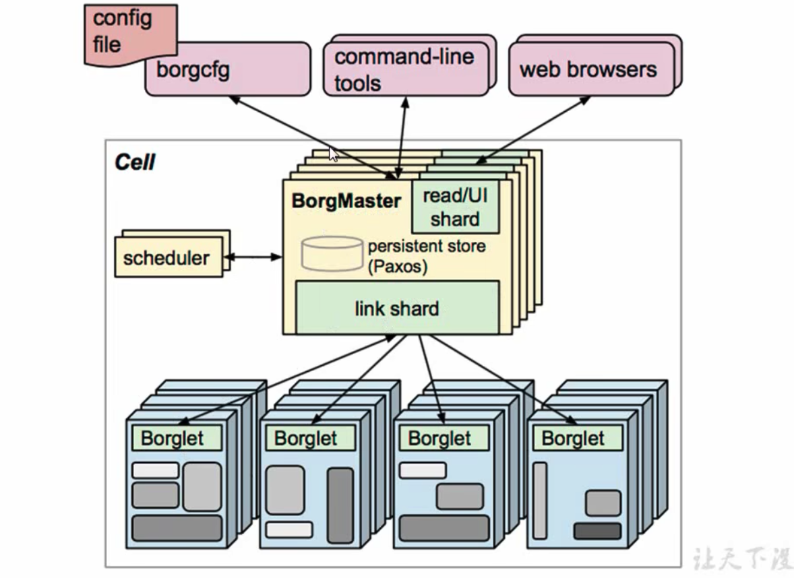
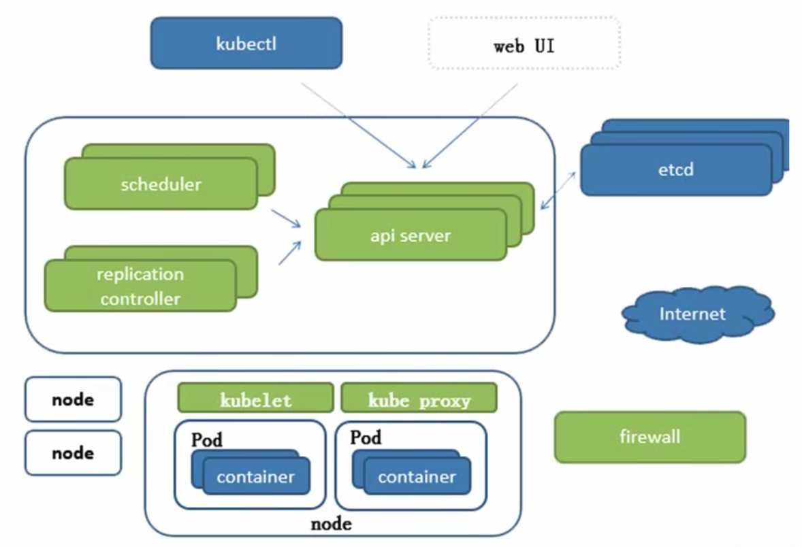
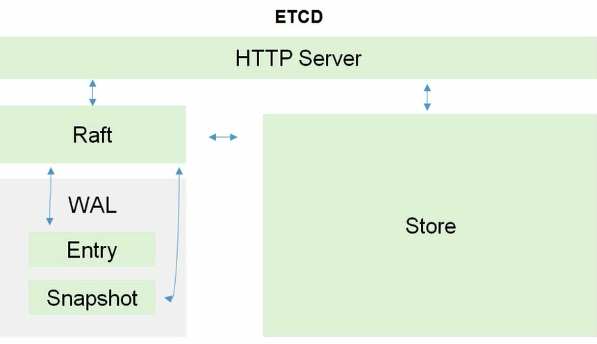

# 组件说明

[B站视频](https://www.bilibili.com/video/BV1w4411y7Go?p=6&spm_id_from=pageDriver&vd_source=8e5fcdfc72b728eda6c147b9ca28620b)

# k8s架构

  

etcd：可信赖分布式键值存储服务，有v2、v3两个版本，v2基于内存，v3基于数据库，v2版在
      k8s v1.11中弃用。  

高可用集群副本数据最好是 >= 3 奇数个  

api server: 所有服务访问统一入口  
controlManager：维持副本期望数目  
Scheduler： 负责接受任务，选择合适的节点进行分配任务  
etcd: 键值对数据库，存储k8s集群所有重要信息  
kubelet: 直接跟容器引擎交互，实现容器的生命周期管理  
kube proxy: 负责写入规则至iptables  
coredns：可以为集群中的svc创建一个域名ip的对应关系解析  
dashboard  
ingress controller： 官方只能实现4层代理，ingress实现七层代理，增加了按主机名、域名进行负载均衡    
federation: 提供一个可以跨集群中心多k8s统一管理功能  
prometheus  
elk: 日志统一分析  