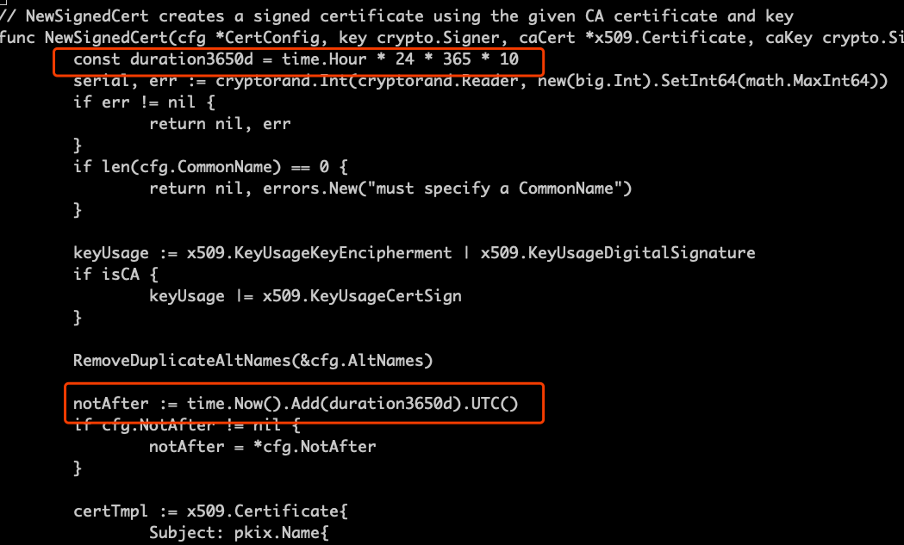
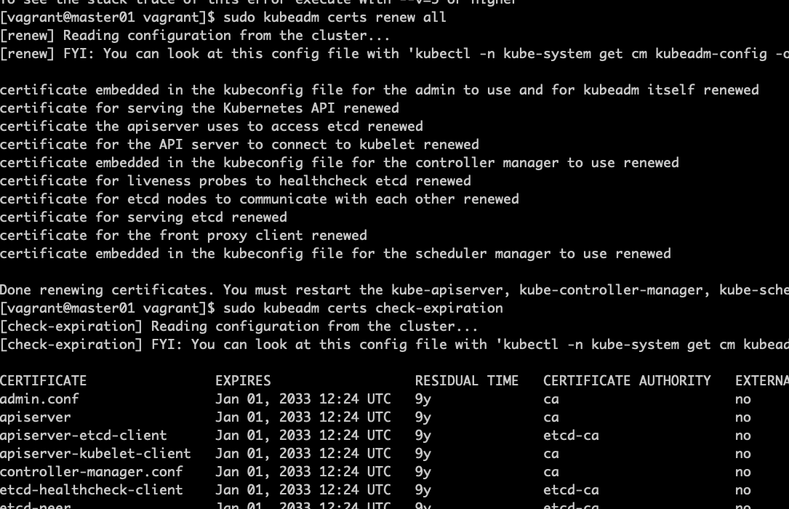

# 证书

## 查看证书日期

cd /etc/kubernetes/pki/  
openssl x509 -in apiserver.crt -text -noout   
openssl x509 -in ca.crt -text -noout  

apiserver证书一年有效，一年更新一次集群的话就不需要管证书问题。  

## 修改证书有效期

### 安装go

wget https://studygolang.com/dl/golang/go1.19.4.linux-amd64.tar.gz  
sudo vi /etc/profile  
export PATH=$PATH:/usr/local/go/bin  
source /etc/profile  
tar -xzvf go1.19.4.linux-amd64.tar.gz -C /usr/local/

### 下载源码

wget https://github.com/kubernetes/kubernetes/archive/refs/tags/v1.23.4.tar.gz
vi cmd/kubeadm/app/util/pkiutil/pki_helpers.go 

make WHAT=cmd/kubeadm GOFLAGS=-v

sudo mv /usr/bin/kubeadm /usr/bin/kubeadm.old  
sudo cp _output/bin/kubeadm /usr/bin/  
sudo chmod a+x /usr/bin/kubeadm  

sudo cp -r /etc/kubernetes/pki /etc/kubernetes/pki.old  
sudo kubeadm certs renew all  

