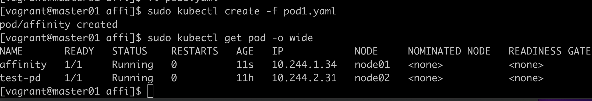
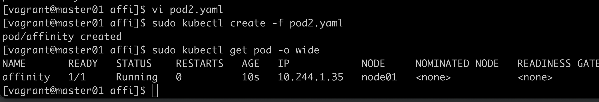
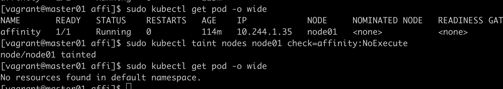
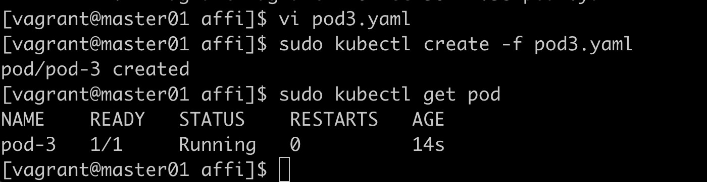
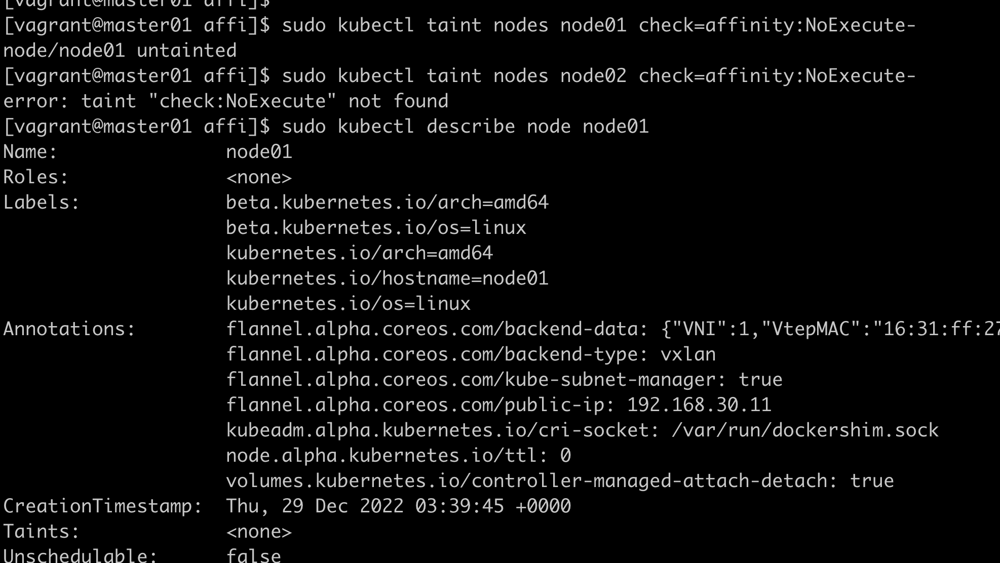
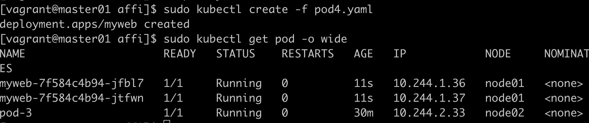
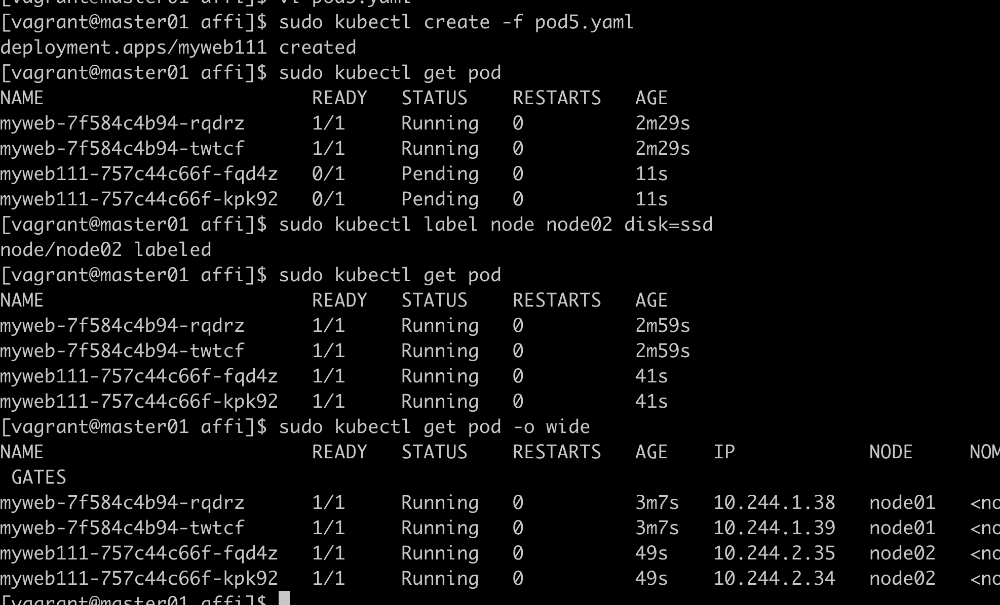

# 调度器

## 调度过程

1、过滤掉不满足条件的节点，叫predicate  
2、对通过的节点按照优先级排序，叫priority  
3、选择优先级最高的节点  

## 节点亲和性

sudo kubectl get pod --show-labels

## node亲和性调度实验

```yaml
apiVersion: v1
kind: Pod
metadata:
  name: affinity
  labels:
    app: node-affinity-pod
spec:
  containers:
    - name: with-node-affinity
      image: nginx:1.9.1
  affinity:
    nodeAffinity:
      requiredDuringSchedulingIgnoredDuringExecution:
        nodeSelectorTerms:
          - matchExpressions:
              - key: kubernetes.io/hostname
                operator: NotIn
                values:
                  - node02
```

这个实验目的是这个pod不往node02调度，结果如下


硬策略：不能满足就不运行  
软策略：有就运行，没有就不运行  

```yaml
apiVersion: v1
kind: Pod
metadata:
  name: affinity
  labels:
    app: node-affinity-pod
spec:
  containers:
    - name: with-node-affinity
      image: nginx:1.9.1
  affinity:
    nodeAffinity:
      preferredDuringSchedulingIgnoredDuringExecution:
        - weight: 1
          preference:
            matchExpressions:
              - key: kubernetes.io/hostname
                operator: In
                values:
                  - node03
```

可以看到在软策略下，即使不满足，也会创建

## 污点Taint

使节点能排斥一类特定的pod  

容忍Toleration，taint和toleration相互配合，可以用来避免pod被分配到不适合的节点上。

### 污点effect的三个选项

NoSchedule: 表示k8s将不会将pod调度到具有该污点的Node上   
PreferNoSchedule: 表示k8s将尽量避免将pod调度到具有该污点的Node上  
NoExecute: 表示k8s将不会将pod调度到具有该污点的Node上，同时会将Node上已经存在的pod驱逐出去  

打污点驱离例子：  


```yaml
apiVersion: v1
kind: Pod
metadata:
  name: pod-3
  labels:
    app: pod-3
spec:
  containers:
    - name: pod-3
      image: nginx:1.9.1
  tolerations:
    - key: "check"
      operator: "Equal"
      value: "nginx"
      effect: "NoExecute"
      tolerationSeconds: 3600
```

说明有污点，容忍这个污点，也能运行

有多个Master存在时，防止资源浪费，可以如下设置：  
kubectl taint nodes master01 node-role.kubernetes.io/master=:PreferNoSchedule

污点去除，复制原命令，最后加-：  
sudo kubectl taint nodes node01 check=affinity:NoExecute-  


清除污点后，查看node01详情污点为空

## 固定节点调度

```yaml
apiVersion: apps/v1
kind: Deployment
metadata:
  name: myweb
spec:
  replicas: 2
  selector: 
    matchLabels:
      name: myweb
  template:
    metadata:
      labels:
        app: myweb
        name: myweb
    spec:
      nodeName: node01
      containers:
        - name: myweb
          image: nginx:1.9.1
          ports:
            - containerPort: 80
```

可以看到固定节点后，两个pod都起在node01上

```yaml
apiVersion: apps/v1
kind: Deployment
metadata:
  name: myweb111
spec:
  replicas: 2
  selector: 
    matchLabels:
      name: myweb
  template:
    metadata:
      labels:
        app: myweb11
        name: myweb
    spec:
      nodeSelector:
        disk: ssd
      containers:
        - name: myweb11
          image: nginx:1.9.1
          ports:
            - containerPort: 80
```

实验说明，也可以按标签固定调度，没有打标签时，一直pending状态，node02打标签后，都创建在node02下

