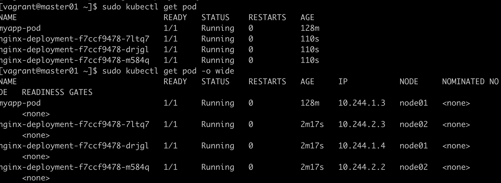
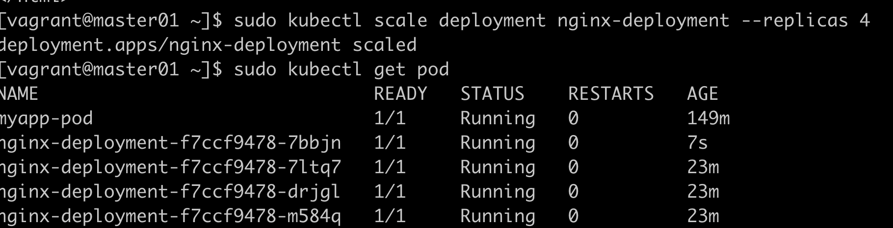
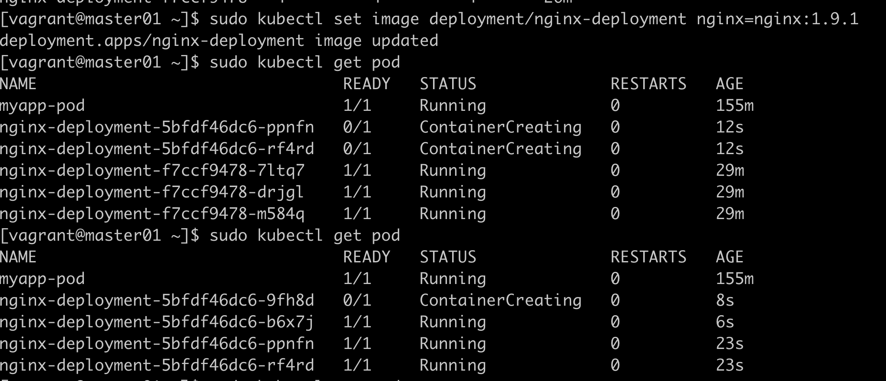
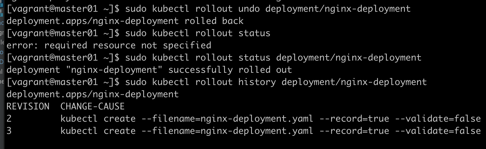
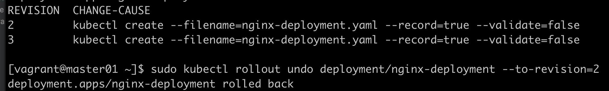

# 资源控制器

声明式编程（Deployment）  apply  
命令式（rs）  create

## 扩容实验

```yaml
apiVersion: apps/v1
kind: Deployment
metadata:
  name: nginx-deployment
spec:
  replicas: 3
  selector:
    matchLabels:
      app: nginx
  template:
    metadata:
      labels:
        app: nginx
    spec:
      containers:
      - name: nginx
        image: nginx:1.7.9
        ports:
        - containerPort: 80
```
sudo kubectl create -f nginx-deployment.yaml --validate=false


扩容


更新镜像


回滚：  


回退到指定版本：


## 命令

删除所有deployment: sudo kubectl delete deployment --all